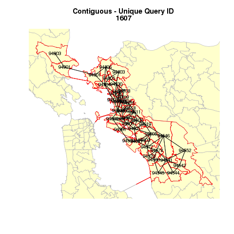

mapContiguityWithR
==================

This was a hired work  - generates a series of maps (total 4,266 map images) revealing contiguity relationship.

I think R is faster than ArcGIS especially for repeated job, and easier to code (the work was by paid hourly, so it had to be done quickly..)

Here is a sample map:

 
