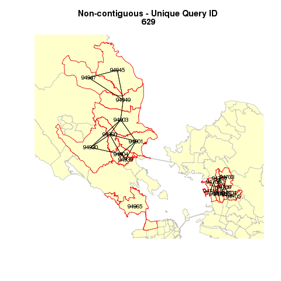
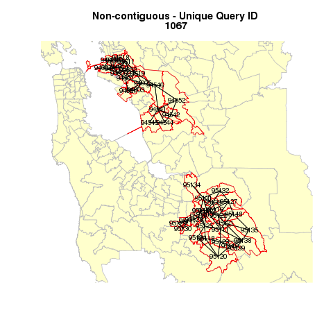
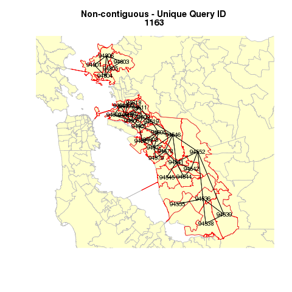
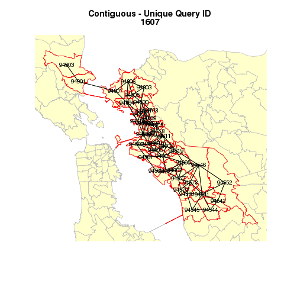
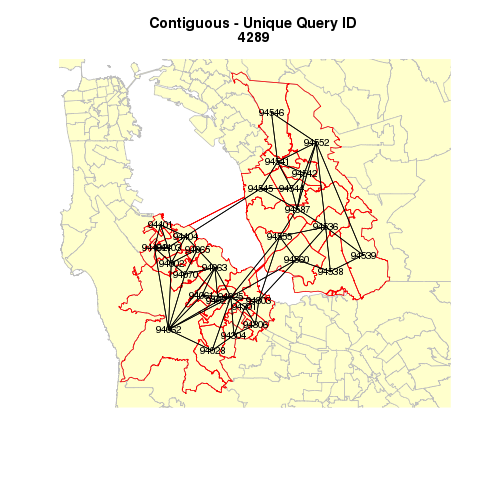

Indentify contiguity of zip code areas, save data & maps 
========================================================

This code was run 3/24/2013-3/25/2013, took for about 22 hours..
Total 4266 maps generated..

```r
# install.packages('knitr') install.packages('Hmisc')
# install.packages('spdep') library(Hmisc) library(knitr) library(spdep)
setwd("/mnt/ide0/home/cmaene/Profxxxxx")
```

```
## Error: cannot change working directory
```

```r
# projection information help:
# https://r-forge.r-project.org/scm/viewvc.php/trunk/inst/proj/esri?view=markup&revision=47&root=rgdal&diff_format=h&pathrev=93
# https://stat.ethz.ch/pipermail/r-sig-geo/2010-October/009775.html
nad1983 <- CRS("+proj=longlat +ellps=GRS80 +datum=NAD83")
```

```
## Error: could not find function "CRS"
```

```r
# zipcodes<-readShapeSpatial('zip_poly101_modified228', ID='ZIP',
# proj4string=nad1983) read own data file - better have a common zip code
# field..
zipCodeList <- read.csv("Zip Code List Query.csv", sep = ",", header = T, colClasses = "character")
zipCodeList[, c("unique_query")] <- as.numeric(zipCodeList[, c("unique_query")])
# create a list 'shell' to hold the results
colInputrow <- c(length(4273))
colUID <- c(length(4273))
colContiguity <- c(length(4273))
zip236 <- readShapeSpatial("zip_poly101_modified236", ID = "OBJECTID", proj4string = nad1983)
```

```
## Error: could not find function "readShapeSpatial"
```

```r
for (i in 1:4273) {
    zipCodeList1 <- data.frame(t(zipCodeList[i, 4:98]))
    zipCodeList2 <- data.frame(zipCodeList1)
    # now merge and then delete the rows where merge didn't happen The
    # following zipcode polygons are 'bridge-modified' version of ESRI
    # zip_poly data (version 10.1)
    zipcodes <- readShapeSpatial("zip_poly101_modified228", ID = "ZIP", proj4string = nad1983)
    zipcodes@data = data.frame(zipcodes@data, zipCodeList2[match(zipcodes@data[, 
        c("ZIP")], zipCodeList2[, 1]), ])
    keep <- !is.na(zipcodes@data[, 5])
    zipcodes@data <- zipcodes@data[keep, ]
    colInputrow[i] <- i
    colUID[i] <- zipCodeList[i, 1]
    # some pairs don't have 'real' pairs (i.e. one of zipcodes don't exist in
    # 2010), causing problems
    possibleError <- tryCatch(zipcodes.queen <- poly2nb(zipcodes[keep, ], queen = T), 
        error = function(e) e)
    if (inherits(possibleError, "error")) 
        next
    num_subgraphs <- n.comp.nb(zipcodes.queen)
    colContiguity[i] <- num_subgraphs$nc
    qid <- as.character(zipCodeList[i, 1])
    if (num_subgraphs$nc > 1) {
        titlename <- c("Non-contiguous - Unique Query ID ", qid)
        pngname <- paste(c("nc_query", qid, ".png"), collapse = "")
    } else {
        titlename <- c("Contiguous - Unique Query ID ", qid)
        pngname <- paste(c("query", qid, ".png"), collapse = "")
    }
    # checking by plotting
    zipcodesxy <- coordinates(zipcodes[keep, ])
    zip236 <- readShapeSpatial("zip_poly101_modified236", ID = "OBJECTID", proj4string = nad1983)
    png(filename = pngname)
    plot(zip236, border = "grey", col = "#FFFFCC", xlim = c(bbox(zipcodes[keep, 
        ])[1, 1], bbox(zipcodes[keep, ])[1, 2]), ylim = c(bbox(zipcodes[keep, 
        ])[2, 1], bbox(zipcodes[keep, ])[2, 2]))
    plot(zipcodes[keep, ], border = "red", pch = 20, add = T)
    plot(zipcodes.queen, zipcodesxy, add = T, cex = 0.2)
    text(zipcodesxy, labels = row.names(zipcodes[keep, c("ZIP")]), cex = 0.8)
    title(main = titlename)
    dev.off()
}
```

```
## Generated a series of maps - samples below
```

 
 
 
 

```r
result <- data.frame(colInputrow, colUID, colContiguity)
# save the result table
write.table(result, "contiguity.csv", sep = ",", row.names = F)
```
